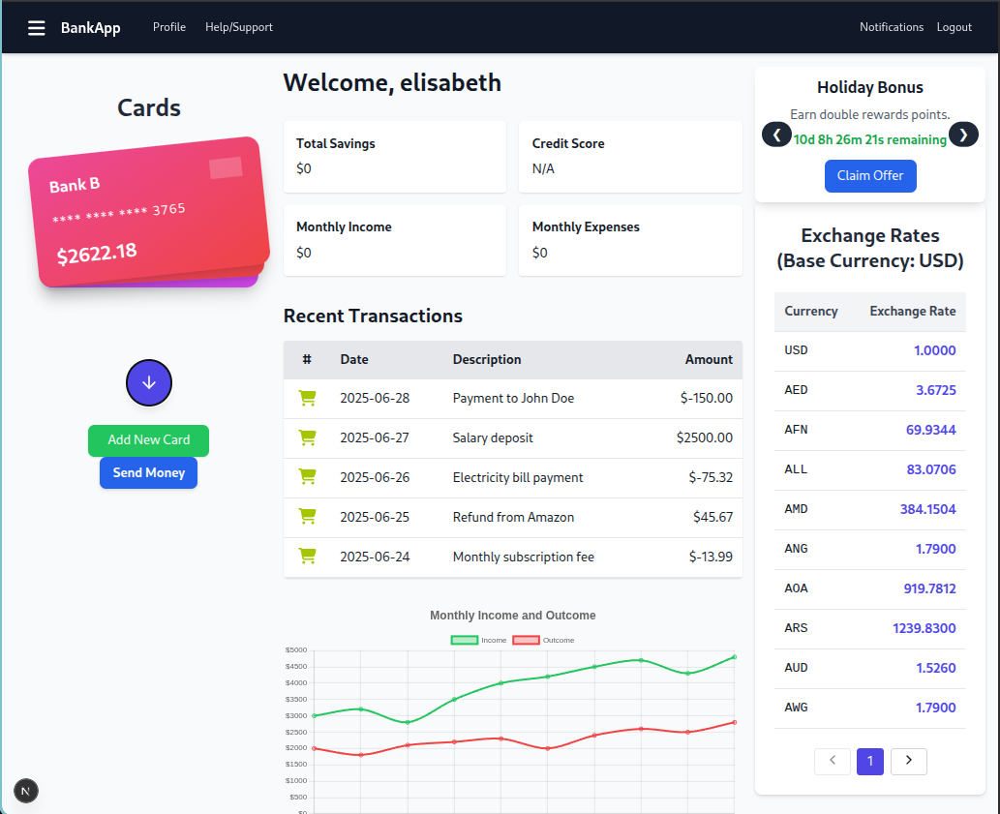
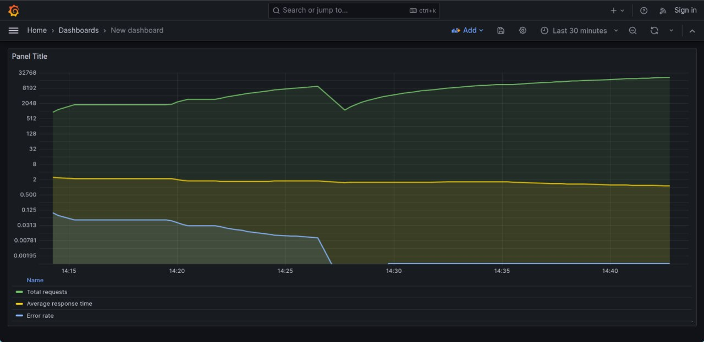

# Demo Bank Application - Full-Stack Secure Banking System

The project is a secure full-stack online baking simulation, built to demonstrate key backend and frontend concepts including authentication, financial transactions, monitoring and system scalability. The application replicates essential features of modern online banking platforms and adds real-world tooling like 2FA, JWT, and performace monitoring with Grafana and Prometheus.

## Architecture overview
- Frontend: Built with Next.js, offering a modern single-page interface for users to login, manage accounts and perform transactions.
- Backend: Powered by Spring Boot, handling business login, user management, security and transactionl processing.
- APIs: RESTful API endpoints for all user interactions, secured with JWT token and protected routes.
- Authentication:
1. JWT(JSON Web Tokens) for session management.
2. Two-Factor Authentication (2FA) using Twilio to send OTP codes via SMS.
- Security:
1. Password hashed with HS512 algorithm and stored using simulated IBANs.
2. Validations ensure transaction integrity and error handling.

## UI/UX Pages Overview

### Login Page
Secure login with username, password, and two-factor authentication (2FA).

### Dashboard page
Summary of account in short manner like balances, recent transactions and alerts in a clean, user-friendly dashboard interfact.

### Monitoring page
Real-time system performance metrics visualized with Grafana, showing API latency currently moment only for authentication process.

## Installation of packages for work with React and Next.js

`npm install next --force`
`npm install react react-dom --force`
`npm install nookies --force` - for cookies

## For stylizing, installation of Tailwind with postcss.config.js

`npm install tailwindcss @tailwindcss/postcss postcss`

